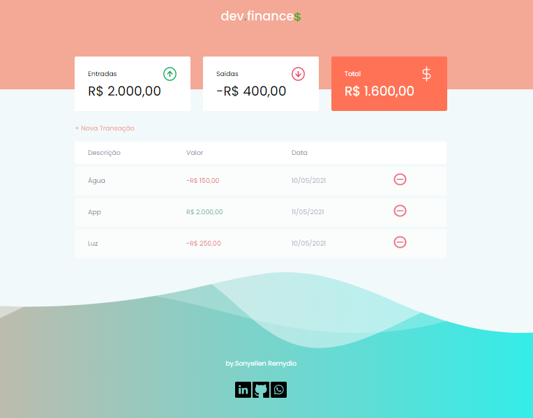

 

## Descrição do Projeto: :computer:

 Um chat para atendimento de clientes em tempo real. 

<h4 align="center"> 
	> Status do Projeto: Concluido :heavy_check_mark:
</h4>

<h1 align="center">
 
  
 

### Tarefas concluídas:  

- [X] Função cadastrar transação
- [X] Função excluir transação
- [X] Função valor total de entrada
- [X] Função valor total de saída
- [X] Função total

 

## Deploy da Aplicação com Vercel: :star:
> https://maratona-discovery.vercel.app/

 

## Linguagens utilizadas :books:

- [HTML](https://devdocs.io/html/)
- [CSS](https://devdocs.io/css/)
- [JavaScript](https://devdocs.io/javascript/)

 

## 📄 Licença

Esse projeto está sob a licença MIT. Veja o arquivo [LICENSE](LICENSE.md) para mais detalhes.

 

Feito com acompanhamento da MARATONA DISCOVEY ♥ by Rocketseat
